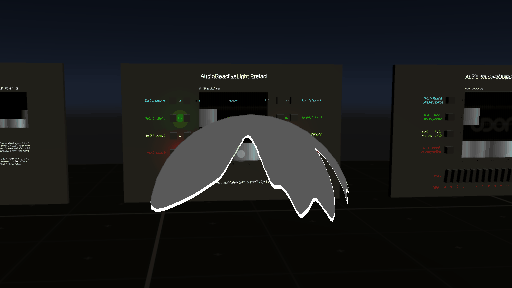
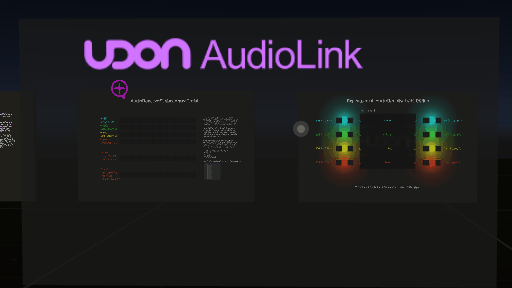

# Using AudioLink

AudioLink can be used in 2 ways.
1. From Udon
2. Directly using the shader (on an Avatar or in a world)

## Using AudioLink in Udon

AudioLink can be used in Udon via the included UdonBehaviours prefixed by `AudioReactive`, such as `AudioReactiveLight` and `AudioReactiveSurface`. However, this use case is not recommended as it requires a fairly expensive GPU readback. Performing all of the work directly in a shader yields much better performance.

## The AudioLink Texture

The AudioLink Texture is a 128 x 64 px RGBA texture which contains several features which allow for the linking of audio and other data to avatars of a world.  It contains space for many more features than are currently implemented and may periodically add functionality. 

The basic map is sort of a hodgepodge of various features avatars may want, and many features have been added over time.

|                         | 0.1.5 | 0.2.0 | 0.2.1 | 0.2.2 | 0.2.3 | 0.2.4 | 0.2.5 | 0.2.6 |
|-------------------------|-------|-------|-------|-------|-------|-------|-------|-------|
| Waveform                |       |   X   |   X   |   X   |   X   |   X   |   X   |   X   |
| Spectrogram             |       |   X   |   X   |   X   |   X   |   X   |   X   |   X   |
| 4 Band (32 history)     |   X   |   X   |   X   |   X   |   X   |   X   |   X   |   X   |
| 4 Band (128 history)    |       |   X   |   X   |   X   |   X   |   X   |   X   |   X   |
| 4 Band Filtered         |       |       |       |       |       |       |   X   |   X   |
| ColorChord              |       |   X   |   X   |   X   |   X   |   X   |   X   |   X   |
| Autocorrelator          |       |       |       |       |   X   |   X   |   X   |   X   |
| Floating Autocorrelator |       |       |       |       |       |   X   |   X   |   X   |
| VU Meter Left           |       |       |       |       |       |   X   |   X   |   X   |
| VU Meter Left+Right     |       |       |       |       |       |       |   X   |   X   |
| Filtered VU meter       |       |       |       |       |       |       |       |   X   |
| AudioLink FPS           |       |       |       |       |       |       |   X   |   X   |
| AudioLink Version Read  |       |       |       |       |       |       |   X   |   X   |
| Synced Instance Time    |       |       |       |       |       |       |   X   |   X   |
| Chronotensity           |       |       |       |       |       |       |       |   X   |
| ColorChord Index Colors |       |       |       |       |       |       |       |   X   |
| Theme Colors            |       |       |       |       |       |       |       |   X   |


## Using the AudioLink Texture

When using the AudioLink texture, there's a few things that may make sense to add to your shader.  You may either use `AudioLink.cginc` (recommended) or copy-paste the header info.

```hlsl

Shader "MyTestShader"
{
    Properties
    {
        _AudioLink ("AudioLink Texture", 2D) = "black" {}
    }
    SubShader
    {
        ... 
        
        Pass
        {
            CGPROGRAM

            ...

            #include "UnityCG.cginc"
    
            ...
            
            #include "../AudioLink/Shaders/AudioLink.cginc"
            ...
        }
    }
}

```

## What is in AudioLink.cginc.


```hlsl
// Map of where features in AudioLink are.
#define ALPASS_DFT                      uint2(0,4)   //Size: 128, 2
#define ALPASS_WAVEFORM                 uint2(0,6)   //Size: 128, 16
#define ALPASS_AUDIOLINK                uint2(0,0)   //Size: 128, 4
#define ALPASS_AUDIOBASS                uint2(0,0)   //Size: 128, 1
#define ALPASS_AUDIOLOWMIDS             uint2(0,1)   //Size: 128, 1
#define ALPASS_AUDIOHIGHMIDS            uint2(0,2)   //Size: 128, 1
#define ALPASS_AUDIOTREBLE              uint2(0,3)   //Size: 128, 1
#define ALPASS_AUDIOLINKHISTORY         uint2(1,0)   //Size: 127, 4
#define ALPASS_GENERALVU                uint2(0,22)  //Size: 12, 1
#define ALPASS_CCINTERNAL               uint2(12,22) //Size: 12, 2
#define ALPASS_CCCOLORS                 uint2(25,22) //Size: 11, 1
#define ALPASS_CCSTRIP                  uint2(0,24)  //Size: 128, 1
#define ALPASS_CCLIGHTS                 uint2(0,25)  //Size: 128, 2
#define ALPASS_AUTOCORRELATOR           uint2(0,27)  //Size: 128, 1
#define ALPASS_GENERALVU_INSTANCE_TIME  uint2(2,22)
#define ALPASS_GENERALVU_LOCAL_TIME     uint2(3,22)
#define ALPASS_GENERALVU_NETWORK_TIME   uint2(4,22)
#define ALPASS_GENERALVU_PLAYERINFO     uint2(6,22)
// Added in version 2.5
#define ALPASS_FILTEREDAUDIOLINK        uint2(0,28)  //Size: 16, 4
// Added in version 2.6
#define ALPASS_CHRONOTENSITY            uint2(16,28) //Size: 8, 4
#define ALPASS_THEME_COLOR0             uint2(0,23)
#define ALPASS_THEME_COLOR1             uint2(1,23)
#define ALPASS_THEME_COLOR2             uint2(2,23)
#define ALPASS_THEME_COLOR3             uint2(3,23)
#define ALPASS_FILTEREDVU               uint2(24,28) //Size: 4, 4
#define ALPASS_FILTEREDVU_INTENSITY     uint2(24,28) //Size: 4, 1
#define ALPASS_FILTEREDVU_MARKER        uint2(24,29) //Size: 4, 1
```

These are the base coordinates for the different data blocks in AudioLink.  For data groups that are multiline, all data is represented as left-to-right (increasing X) then incrementing Y and scanning X from left to right on the next line.  They are the following groups that contain the following data:

### `ALPASS_DFT`

A 128 x 2 block of data containing a DFT (like an FFT, but even intervals in chromatic space and discarding phase information).  There are a total of ten octaves of audio data, each octave taking up 24 pixels and having the following format per pixel:
 * RED: "mag" : Raw spectrum magnitude.
 * GRN: "magEQ" : Filtered power EQ'd, used by AudioLink
 * BLU: "magfilt" : Heavily filtered spectrum for use in ColorChord
 * ALP: RESERVED.

AudioLink reserves the right to change:
 * The window that is used for calculations.
 * The type of DFT performed.
 * The way the parts are EQd or IIRd
 * The alpha channel.
 * What bins 240-255 are used for.

A mechanism to use this field on a texture would be:
```hlsl
    return AudioLinkLerpMultiline( ALPASS_DFT + uint2( i.uv.x * AUDIOLINK_ETOTALBINS, 0 ) ).rrrr;
```

### `ALPASS_WAVEFORM`

Waveform data is stored in 16 rows, for a total of 2048 (2046 usable) points sample points.  The format per pixel is:
 * RED: 24,000 SPS audio, amplitude. Contains 2046 samples.
 * GRN: 48,000 SPS audio, amplitude. Contains 2048 samples.
 * BLU: 12,000 SPS audio, amplitude. Contains 1023 samples.
 * ALP: 24,000 SPS audio, differential. For left channel take .r + .a, for right take .r - .a. (Contains 2046 Samples) **Added in version 2.5**

The reason for the numbers are off by one is because shader parameters can only store 1023 values, not 1024 and AudioLink uses 4 blocks.

Every sample has the following gain applied to it:

```hlsl
float incomingGain = ((_AudioSource2D > 0.5) ? 1.f : 100.f);

// Enable/Disable autogain.
if( _EnableAutogain )
{
    float4 LastAutogain = AudioLinkData( ALPASS_GENERALVU + int2( 11, 0 ) );

    //Divide by the running volume.
    incomingGain *= 1./(LastAutogain.x + _AutogainDerate);
}
```


A mechanism to use this field on a texture would be:
```hlsl
    return AudioLinkLerpMultiline( ALPASS_WAVEFORM + uint2( i.uv.x * 1024, 0 ) ).rrrr;
```


### `ALPASS_AUDIOLINK`

AudioLink is the 1 x 4 px data at the far corner of the texture.  It is updated every frame with bass, low-mid, high-mid and treble ranges.  It triggers in amplitude, and contains the most recent frame.

The channels are:
 * RED: AudioLink Impulse Data
 * GRN / BLU: Currently the same as RED, but considering changing so that they may have sligthly different impulse response.
 * ALP: Reserved.
 
AudioLink v1 note: The 32x4 section of the AudioLink texture is still compatible with AudioLink v1 at the time of writing this.

A mechanism to use this field on a texture would be:
```hlsl
    return AudioLinkData( ALPASS_AUDIOLINK + uint2( 0, i.uv.y * 4. ) ).rrrr;
```

### `ALPASS_AUDIOLINKHISTORY`

The history of ALPASS_AUDIOLINK, cascading right in the texture, with the oldest copies of `ALPASS_AUDIOLINK` on the far right.

A mechanism to use this field smoothly would be the following - note that we use the `ALPASS_AUDIOLINK` instead of `ALPASS_AUDIOLINKHISTORY`:
```hlsl
    return AudioLinkLerp( ALPASS_AUDIOLINK + float2( i.uv.x * AUDIOLINK_WIDTH, i.uv.y * 4. ) ).rrrr;
```


### `ALPASS_GENERALVU`

This is the General Data and VU Data block. Note that for intensities, we use RMS and Peak, and do not currently take into account A and C weighting.

Note: LF's are decoded by passing the RGBA value into DecodeLongFloat which is used to encode a precise value into a half-float pixel, which can output an int32, uint32, or float, depending on context.

It contains the following dedicated pixels:

<table>
<tr><th>Pixel Offset</th><th>Absolute Pixel</th><th>Description</th><th>Red</th><th>Green</th><th>Blue</th><th>Alpha</th></tr>
<tr><td>0, 0 </td><td>0, 22</td><td>Version Number and FPS</td><td>Version (Version Minor)</td><td>0 (Version Major)</td><td>System FPS</td><td></td></tr>
<tr><td>1, 0 </td><td>1, 22</td><td>AudioLink FPS</td><td></td><td>AudioLink FPS</td><td></td><td></td></tr>
<tr><td>2, 0 </td><td>2, 22</td><td>Milliseconds Since Instance Start</td><td colspan=4><pre>AudioLinkDecodeDataAs[UInt/Seconds]( ALPASS_GENERALVU_INSTANCE_TIME )</pre></td></tr>
<tr><td>3, 0 </td><td>3, 22</td><td>Milliseconds Since 12:00 AM Local Time</td><td colspan=4><pre>AudioLinkDecodeDataAs[UInt/Seconds]( ALPASS_GENERALVU_LOCAL_TIME )</pre></td></tr>
<tr><td>4, 0 </td><td>4, 22</td><td>Milliseconds In Network Time</td><td colspan=4><pre>AudioLinkDecodeDataAs[UInt/Seconds]( ALPASS_GENERALVU_LOCAL_TIME )</pre></td></tr>
<tr><td>4, 0 </td><td>6, 22</td><td>Player Data Info</td><td>Number of Players In Instance</td><td>1 if you are master</td><td>1 if you are owner</td><td>Reserved.</td></tr>
<tr><td>8, 0 </td><td>8, 22</td><td>Current Intensity</td><td>RMS Left</td><td>Peak Left</td><td>RMS Right</td><td>Peak right</td></tr>
<tr><td>9, 0 </td><td>9, 22</td><td>Marker Value</td><td>RMS Left</td><td>Peak Left</td><td>RMS Right</td><td>Peak Right</td></tr>
<tr><td>10, 0</td><td>10, 22</td><td>Marker Times</td><td>RMS Left</td><td>Peak Left</td><td>RMS Right</td><td>Peak Right</td></tr>
<tr><td>11, 0</td><td>11, 22</td><td>Autogain</td><td>Asymmetrically Filtered Volume</td><td>Symmetrically filtered Volume</td><td></td><td></td></tr>
<tr><td>0, 1</td><td>0, 23</td><td>Theme Color 0 / Auto Audio Color</td><td colspan=4>ALPASS_THEME_COLOR0</td></tr>
<tr><td>1, 1</td><td>1, 23</td><td>Theme Color 1 / Auto Audio Color</td><td colspan=4>ALPASS_THEME_COLOR1</td></tr>
<tr><td>2, 1</td><td>2, 23</td><td>Theme Color 2 / Auto Audio Color</td><td colspan=4>ALPASS_THEME_COLOR2</td></tr>
<tr><td>3, 1</td><td>3, 23</td><td>Theme Color 3 / Auto Audio Color</td><td colspan=4>ALPASS_THEME_COLOR3</td></tr>
<tr><td>4, 1</td><td>4, 23</td><td>(Internal)</td><td colspan=4>Internal Timing Tracking</td></tr>
</table>

Note that for milliseconds since instance start, and milliseconds since 12:00 AM local time, you may use `ALPASS_GENERALVU_INSTANCE_TIME` and `ALPASS_GENERALVU_LOCAL_TIME` with `AudioLinkDecodeDataAsUInt(...)` and `AudioLinkDecodeDataAsSeconds(...)`

```hlsl
#define ALPASS_GENERALVU_INSTANCE_TIME   int2(2,22)
#define ALPASS_GENERALVU_LOCAL_TIME      int2(3,22)
// Added/updated in version 2.5
#define ALPASS_GENERALVU_NETWORK_TIME    int2(4,22)
#define ALPASS_GENERALVU_PLAYERINFO      int2(6,22)
```

Various Usages of this field would be:
```hlsl
    AudioLinkData( ALPASS_GENERALVU + uint2( 0, 0 )).x;  //2.04 for AudioLink 2.4.
    AudioLinkData( ALPASS_GENERALVU + uint2( 1, 0 )).x;  //System FPS
    AudioLinkDecodeDataAsSeconds( ALPASS_GENERALVU_INSTANCE_TIME ); //Time since start of instance, but wraps every 1.5 days.
    AudioLinkDecodeDataAsSeconds( ALPASS_GENERALVU_NETWORK_TIME ); //Time that matches for all players for animations, but wraps every 1.5 days.
    AudioLinkDecodeDataAsUInt( ALPASS_GENERALVU_LOCAL_TIME ); //Local time.
    AudioLinkData( ALPASS_GENERALVU + uint2( 8, 0 )).x;  // Current intensity of sound.
    AudioLinkData( ALPASS_GENERALVU + uint2( 11, 0 )).y;  // slow responce of volume of incoming sound.
```

NOTE: There are potentially issues with `ALPASS_GENERALVU_INSTANCE_TIME` if a map is updated mid-instance and the instance owner leaves mid-instance, so it is preferred that for effects that don't care when the instance started, use `ALPASS_GENERALVU_NETWORK_TIME` as this will allow you to animate things so that all players see your animation the same as you.

### `ALPASS_FILTEREDVU`
This section of the data texture contains filtered versions of the "Current Intensity" (both RMS and Peak), "Marker Values" from the `ALPASS_GENERALVU` section. These values move in slower, much more natural fashion. 

`ALPASS_FILTEREDVU` and `ALPASS_FILTEREDVU_INTENSITY` refer to the filtered intensity. It is a strip of 4x1 pixels, each with varying levels of filtering, from slowest to fastest moving. You can sample them like so:
```hlsl
float4 vu = AudioLinkData(ALPASS_FILTEREDVU_INTENSITY + uint2(i.uv.x*4, 0));
```

`ALPASS_FILTEREDVU_MARKER` refers to filtered marker values. Whenever a new 'peak volume' is reached, these values rapidly increase. If no peaks occur for a brief moment, they rapidly fade to the current intensity. They can sampled like so:
```hlsl
float4 marker = AudioLinkData(ALPASS_FILTEREDVU_MARKER + uint2(i.uv.x*4, 0));
```

Just as with `ALPASS_GENERALVU`, each color channel for both of these sections stores left RMS, left peak, right RMS, right peak respectively.

For an example of how to use this feature, check the "FilteredVUDebug" shader in the Shaders folder.

### `ALPASS_THEME_COLORx`

AudioLink provides 4 "Theme" colors users can apply to their avatars **though it is recommended you only use colors 0 and 1 for the time being**.  By default this uses ColorChord colors, but, world creators can select theme colors for their map and change them dynamically by setting the following: 

```cs
	bool enableThemeColors;
	Color setThemeColor0;
	Color setThemeColor1;
	Color setThemeColor2;
	Color setThemeColor3;
```
Then calling `UpdateThemeColors()`.

You can access this with the following command: `AudioLinkData(ALPASS_THEME_COLOR0)` and can read `ALPASS_THEME_COLOR0`, `ALPASS_THEME_COLOR1`, `ALPASS_THEME_COLOR2`, or `ALPASS_THEME_COLOR3`. 

### `ALPASS_CCINTERNAL`

Internal ColorChord note representation.  Subject to change.

### `ALPASS_CCCOLORS`

Also known as ColorChord index colors. These are raw color outputs from derived from notes by ColorChord. Good for mapping UVs onto.

It is recommended you index into no more than the first 4 or 5, after that the colors are much less interesting.

These really are just colors with varying intensities, so you can just use it as a color. Unlike other ways to sample colors from ColorChord, these colors will be relatively stable over time, and may thus lend themselves nicely to coloring world props such as lights.

Example:

```hlsl
	AudioLinkData( ALPASS_CCCOLORS + uint( colornumber + 1, 0 ) );
```

### `ALPASS_CCSTRIP`

A single linear strip of ColorChord, think of it as a linear pie chart.  You can directly apply the colors here directly to surfaces.


A mechanism to use this field smoothly would be:
```hlsl
    return AudioLinkLerp( ALPASS_CCSTRIP + float2( i.uv.x * AUDIOLINK_WIDTH, 0 ) ).rgba;
```

### `ALPASS_CCLIGHTS`


Two rows, the bottom row contains raw colorchord light values.  Useful for if you have individual objects or lights which need a sound-correlated color that are discrete.  I.e. pieces of confetti, lamps, speakers, blocks, etc.

The top (0,1) row is used to track internal aspects of ColorChord state.  Subject to change. Do not use.

A mechanism to use this field smoothly would be:
```hlsl
    return AudioLinkData( ALPASS_CCLIGHTS + uint2( uint( i.uv.x * 8 ) + uint(i.uv.y * 16) * 8, 0 ) ).rgba;
```

### `ALPASS_AUTOCORRELATOR`

The red channel of this row provides a fake autocorrelation of the waveform.  It resynthesizes the waveform from the DFT.  It is symmetric,so only the right half is presented via AudioLink.  To use it, we recommend mirroring it around the left axis.
The green channel of this row provides an uncorrelated autocorrelator. It's like the red channel but doesn't have a beginning or an end.


The red value is the acutal autocorrelator value, centered around the 0th bin. The green value is where all the phases of the frequency bins are scrambled to prevent any obvious "up."

```hlsl
    return AudioLinkLerp( ALPASS_AUTOCORRELATOR + float2( ( abs( 1. - i.uv.x * 2. ) ) * AUDIOLINK_WIDTH, 0 ) ).rrrr;
```

### `ALPASS_FILTEREDAUDIOLINK`

This is just the initial audiolink values, but very heavily filtered, so they move very smoothly.  This feature was added in version 2.5.

### `ALPASS_CHRONOTENSITY`

This is a section of values which increase and decrease cumulatively based on 4-band data.
This allows things to move smoothly in time, where the speed of motion is controlled by intensity.  Each X offset has a different effect.

You must read this using `AudioLinkDecodeDataAsUInt( ALPASS_CHRONOTENSITY + offset ) % LOOP`. Where `LOOP` is the period in which you want to loop over.  Otherwise, as the number gets too large, motion will become chonky.  For instance, if you want to get a rotation, since rotation goes from 0 to `2*pi`, you can modulus by `628319` and divide by `100000.0`. As a reference, with this scaling, you can expect a full rotation every 2.8 seconds if you're using `offset.x = 4` and the band is dark during that time.

There are some helper methods for sampling chronotensity in the `AudioLink.cginc` file that may make sampling this part of the texture simpler. If you are looking for a replacement for `_Time.y`, check out `AudioLinkGetChronoTime(index, band)`.

One can think of the values from chronotensity as being in some very small unit of time, like a millisecond. Thus, the values will get very large very fast, until they finally overflow and loop back to 0. To make the overflow happen faster, one can use a modulo operation as mentioned above. To get resulting value into a usable range, one can then divide by some constant. The size of the value used for the modulo will control how long the final value takes to loop back to 0, and the value in the division will control the interval (or speed) of the final value. Here are some examples:
```hlsl
// Gives a value in [0; 1] interval
float chrono = (AudioLinkDecodeDataAsUInt( ALPASS_CHRONOTENSITY  + uint2( 1, _AudioLinkBand ) ) % 1000000) / 1000000.0;

// Gives a value also in [0; 1], but it will loop around faster
float chrono = (AudioLinkDecodeDataAsUInt( ALPASS_CHRONOTENSITY  + uint2( 1, _AudioLinkBand ) ) % 100000) / 100000.0;

// Gives a value in [0; 6.28] range
float chrono = (AudioLinkDecodeDataAsUInt( ALPASS_CHRONOTENSITY  + uint2( 1, _AudioLinkBand ) ) % 628319) / 100000.0;

// Also gives a value in [0; 6.28 range]
float chrono = (AudioLinkDecodeDataAsUInt( ALPASS_CHRONOTENSITY  + uint2( 1, _AudioLinkBand ) ) % 100000) / 100000.0 * 6.28;
```
When doing this division, make sure to divide by a float! Dividing by `1000` is _NOT_ the same as dividing by `1000.0`, as the former will result in integer division, which is not what you want!

`offset.y` offset is which one of the 4 AudioLink bands the effect is based off of.

| `offset.x` | Description |
| - | ----------- |
| 0 | Motion increases as intensity of band increases. It does not go backwards. |
| 1 | Same as above but uses `ALPASS_FILTERAUDIOLINK` instead of `ALPASS_AUDIOLINK` |
| 2 | Motion moves back and forth as a function of intensity. |
| 3 | Same as above but uses `ALPASS_FILTERAUDIOLINK` instead of `ALPASS_AUDIOLINK` |
| 4 | Fixed speed increase when the band is dark. Stationary when light. |
| 5 | Same as above but uses `ALPASS_FILTERAUDIOLINK` instead of `ALPASS_AUDIOLINK` |
| 6 | Fixed speed increase when the band is dark. Fixed speed decrease when light. |
| 7 | Same as above but uses `ALPASS_FILTERAUDIOLINK` instead of `ALPASS_AUDIOLINK`. |

You can combine these to create new motion.
For example, to get "Fixed increase when the band is light" you could subtract a uint sample with `offset.x = 6` from a uint sample with `offset.x = 4`.

### Other defines

```hlsl
// Some basic constants to use (Note, these should be compatible with
// future version of AudioLink, but may change.
#define AUDIOLINK_SAMPHIST              3069 // Internal use for algos, do not change.
#define AUDIOLINK_SAMPLEDATA24          2046
#define AUDIOLINK_EXPBINS               24
#define AUDIOLINK_EXPOCT                10
#define AUDIOLINK_ETOTALBINS            (AUDIOLINK_EXPBINS * AUDIOLINK_EXPOCT)
#define AUDIOLINK_WIDTH                 128
#define AUDIOLINK_SPS                   48000 // Samples per second
#define AUDIOLINK_ROOTNOTE              0
#define AUDIOLINK_4BAND_FREQFLOOR       0.123
#define AUDIOLINK_4BAND_FREQCEILING     1
#define AUDIOLINK_BOTTOM_FREQUENCY      13.75
#define AUDIOLINK_BASE_AMPLITUDE        2.5
#define AUDIOLINK_DELAY_COEFFICIENT_MIN 0.3
#define AUDIOLINK_DELAY_COEFFICIENT_MAX 0.9
#define AUDIOLINK_DFT_Q                 4.0
#define AUDIOLINK_TREBLE_CORRECTION     5.0

// ColorChord constants
#define COLORCHORD_EMAXBIN              192
#define COLORCHORD_IIR_DECAY_1          0.90
#define COLORCHORD_IIR_DECAY_2          0.85
#define COLORCHORD_CONSTANT_DECAY_1     0.01
#define COLORCHORD_CONSTANT_DECAY_2     0.0
#define COLORCHORD_NOTE_CLOSEST         3.0
#define COLORCHORD_NEW_NOTE_GAIN        8.0
#define COLORCHORD_MAX_NOTES            10
```

The tools to read the data out of AudioLink.
 * `float4 AudioLinkData( int2 coord )` - Retrieve a bit of data from _AudioTexture, using whole numbers.
 * `float4 AudioLinkDataMultiline( int2 coord )` - Same as `AudioLinkData` except that if you read off the end of one line, it continues reading onthe next.
 * `float4 AudioLinkLerp( float2 fcoord )` - Interpolate between two pixels, useful for making shaders not look jaggedy.
 * `float4 AudioLinkLerpMultiline( float2 fcoord )` - `AudioLinkLerp` but wraps lines correctly.

A couple utility macros/functions

 * `glsl_mod( x, y )` - returns a well behaved in negative version of `fmod()`
 * `float4 CCHSVtoRGB( float3 hsv )` - Standard HSV/L to RGB function.
 * `float4 CCtoRGB( float bin, float intensity, int RootNote )` - ColorChord's standard color generation function.
 * `bool AudioLinkIsAvailable()` - Checks is AudioLink data texture is present
 * `float AudioLinkGetVersion()` - Returns the running version of AudioLink as a float
 * `float Remap(float t, float a, float b, float u, float v)` - Remaps value t from [a; b] to [u; v]

### Table for does it make sense to index with?

Where the following mapping is used:

 * Data = `AudioLinkData( ... )`
 * DataMultiline = `AudioLinkDataMultiline( ... )`
 * Lerp = `AudioLinkLerp( ... )`
 * LerpMultiline = `AudioLinkLerpMultiline( ... )`

| | Data | DataMultiline | Lerp | LerpMultiline | Start Coord | Size | Available Since |
| --- | --- | --- | --- | --- | --- | --- | --- |
| ALPASS_DFT  | ✅ | ✅ | ✅ | ✅ | 0,4 | 128, 2 | v2.2 |
| ALPASS_WAVEFORM  | ✅ | ✅ | ✅ | ✅ | 0, 6 | 128, 16 | v2.2 |
| ALPASS_AUDIOLINK  | ✅ |  | ✅ |  | 0, 0 | 1, 4 | v1.0 |
| ALPASS_AUDIOLINKHISTORY  | ✅ |  | ✅ |  | 1, 0 | 127, 4 | v1.0 |
| ALPASS_GENERALVU  | ✅ |  |  |  |  0, 22 | 12, 2 | v2.2 |
| ALPASS_CCINTERNAL  | ✅ |  |  |  | 12, 22 | 12, 2 | v2.2 |
| ALPASS_CCSTRIP  | ✅ |   | ✅ |   | 0, 24 | 128, 1 | v2.2 |
| ALPASS_CCLIGHTS  | ✅ | ✅ |   |   | 0, 25 | 128, 2 | v2.3 |
| ALPASS_AUTOCORRELATOR  | ✅ |   | ✅ |   | 0, 27 | 128, 1 | v2.3 |
| ALPASS_FILTEREDAUDIOLINK  | ✅ |   | ✅ |   | 0, 28 | 16, 4 | v2.5 |


## Examples

### Basic Test with AudioLink
Once you have these pasted into your new shader and you drag the AudioLink texture onto your material, you can now retrieve data directly from the AudioLink texture.  For instance in this code 
snippet, we can make a cube display just the current 4 AudioLink values.  We set the X component in the texture to 0, and the Y component to be based on the Y coordinate in the texture.

```hlsl
fixed4 frag (v2f i) : SV_Target
{
    return AudioLinkData( ALPASS_AUDIOLINK + int2( 0, i.uv.y * 4. ) ).rrrr;
}
```


### Basic Test with sample data.
Audio waveform data is in the ALPASS_WAVEFORM section of the AudioLink texture.  This red color of this group of 128x16 pixels represents the last 85ms of the incoming waveform data.  This
can be used to draw the waveform onto a surface or use it in other ways.

```hlsl
float Sample = AudioLinkLerpMultiline( ALPASS_WAVEFORM + float2( 200. * i.uv.x, 0 ) ).r;
return 1 - 50 * abs( Sample - i.uv.y* 2. + 1 );
```


### Using the spectrogram

The spectrogram portion of audiolink contains the frequency amplitude of every 1/24th of an octave, starting at A-1 (13.75Hz).  This can be used to display something with frequency respones to it.
  
This demo shows off a few things.
 * Reading the spectrogram from `ALPASS_DFT`
 * Doing something a little more interesting with the surface.  Faking alpha with `discard`.

```hlsl
float noteno = i.uv.x*AUDIOLINK_ETOTALBINS;

float4 spectrum_value = AudioLinkLerpMultiline( ALPASS_DFT + float2( noteno, 0. ) )  + 0.5;

//If we are below the spectrum line, discard the pixel.
if( i.uv.y < spectrum_value.z )
    discard;
else if( i.uv.y < spectrum_value.z + 0.01 )
    return 1.;
return 0.1;
```



### AutoCorrelator + ColorChord Linear + Geometry

This demo does several more things.
 * It operates in the vertex shader instead of the fragment shader mostly. 
 * It also reads the autocorrelator instead of the DFT or the Waveform data.  
 * It reads colorchord to apply some color to the object.

```hlsl
v2f vert (appdata v)
{
    v2f o;
    float3 vp = v.vertex;

    o.vpOrig = vp;

    // Generate a value for how far around the circle you are.
    // atan2 generates a number from -pi to pi.  We want to map
    // this from -1..1.  Tricky: add 0.001 to x otherwise
    // we lose a vertex at the poll because atan2 is undefined.
    float phi = atan2( vp.x+0.001, vp.z ) / 3.14159;
    
    // We want to mirror the -1..1 so that it's actually 0..1 but
    // mirrored.
    float placeinautocorrelator = abs( phi );
    
    // Note: We don't need lerp multiline because the autocorrelator
    // is only a single line.
    float autocorrvalue = AudioLinkLerp( ALPASS_AUTOCORRELATOR +
        float2( placeinautocorrelator * AUDIOLINK_WIDTH, 0. ) );
    
    // Squish in the sides, and make it so it only perterbs
    // the surface.
    autocorrvalue = autocorrvalue * (.5-abs(vp.y)) * 0.4 + .6;

    // Perform same operation to find max.  The 0th bin on the 
    // autocorrelator will almost always be the max
    o.corrmax = AudioLinkLerp( ALPASS_AUTOCORRELATOR ) * 0.2 + .6; 

    // Modify the original vertices by this amount.
    vp *= autocorrvalue;

    o.vpXform = vp;                
    o.vertex = UnityObjectToClipPos(vp);
    return o;
}

fixed4 frag (v2f i) : SV_Target
{
    // Decide how we want to color from colorchord.
    float ccplace = length( i.vpXform.xz )*2. / i.corrmax;

    // Get a color from ColorChord
    float4 colorchordcolor = AudioLinkData( ALPASS_CCSTRIP +
        float2( AUDIOLINK_WIDTH * ccplace, 0. ) ) + 0.01;

    // Shade the color a little.
    colorchordcolor *= length( i.vpXform.xyz ) * 15. - 2.0;
    return colorchordcolor;
}
```


### Using Ordinal UVs to make some neat speakers.

UVs go from 0 to 1, right?  Wrong!  You can make UVs anything you fancy, anything ±3.4028 × 10³⁸.  They don't care. So, while we can make the factional part of a UV still represent something meaningful in a texture or otherwise, we can use the whole number (ordinal) part to represent something else.  For instance, the band of AudioLink we want an object to respond to.


```hlsl
v2f vert (appdata v)
{
    v2f o;
    float3 vp = v.vertex;

    // Pull out the ordinal value
    int whichzone = floor(v.uv.x-1);
    
    //Only affect it if the v.uv.x was greater than or equal to 1.0
    if( whichzone >= 0 )
    {
        float alpressure = AudioLinkData( ALPASS_AUDIOLINK + int2( 0, whichzone ) ).x;
        vp.x -= alpressure * .5;
    }

    o.opos = vp;
    o.uvw = float3( frac( v.uv ), whichzone + 0.5 );                
    o.vertex = UnityObjectToClipPos(vp);
    o.normal = UnityObjectToWorldNormal( v.normal );
    return o;
}

fixed4 frag (v2f i) : SV_Target
{
    float radius = length( i.uvw.xy - 0.5 ) * 30;
    float3 color = 0;
    if( i.uvw.z >= 0 )
    {
        // If a speaker, color it with a random ColorChord light.
        color = AudioLinkLerp( ALPASS_AUDIOLINK + float2( radius, i.uvw.z ) ).rgb * 10. + 0.5;
        
        //Adjust the coloring on the speaker by the normal
        color *= (dot(i.normal.xyz,float3(1,1,-1)))*.2;
        
        color *= AudioLinkData( ALPASS_CCLIGHTS + int2( i.uvw.z, 0) ).rgb;
    }
    else
    {
        // If the box, use the normal to color it.
        color = abs(i.normal.xyz)*.01+.02;
    }
    
    return float4( color ,1. );
}
```

### Using Virtual Clocks

You can virtually sync objects, which means they will be synced across the instance for all users, however they use no networking, syncing or Udon to do so.  Application would be effects that you want to have be in motion and appear the same on all player's screens.

If you were to make your effect using _Time, it would use the player's local instance time, but if you make your effect using `AudioLinkDecodeDataAsSeconds(ALPASS_GENERALVU_NETWORK_TIME)` then all players will see your effect exactly the same.



```hlsl
// Utility function to check if a point lies in the unit square. (0 ... 1)
float inUnit( float2 px ) { float2 tmp = step( 0, px ) - step( 1, px ); return tmp.x * tmp.y; }

float2 hash12(float2 n){ return frac( sin(dot(n, 4.1414)) * float2( 43758.5453, 38442.558 ) ); }

fixed4 frag (v2f i) : SV_Target
{
    // 23 and 31 LCM of 713 cycles for same corner bounce.
    const float2 collisiondiv = float2( 23, 31 );

    // Make the default size of the logo take up .2 of the overall object,
    // but let the user scale the size of their logo using the texture
    // repeat sliders.
    float2 logoSize = .2*_Logo_ST.xy;
    
    // Calculate the remaining area that the logo can bounce around.
    float2 remainder = 1. - logoSize;

    // Retrieve the instance time.
    float instanceTime = AudioLinkDecodeDataAsSeconds( ALPASS_GENERALVU_NETWORK_TIME );

    // Calculate the total progress made along X and Y irrespective of
    // the total number of bounces made.  But then compute where the
    // logo would have ended up after that long period of time.
    float2 logoUV = i.uv.xy / logoSize;
    float2 xyprogress = instanceTime * 1/collisiondiv;
    int totalbounces = floor( xyprogress * 2. ).x + floor( xyprogress * 2. ).y;
    float2 xyoffset = abs( frac( xyprogress ) * 2. - 1. );

    // Update the logo position with that location.
    logoUV -= (remainder*xyoffset)/logoSize;

    // Read that pixel.
    float4 logoTexel =  tex2D( _Logo, logoUV );
    
    // Change the color any time it would have hit a corner.
    float2 hash = hash12( totalbounces );
    
    // Abuse the colorchord hue function here to randomly color the logo.
    logoTexel.rgb *= CCHSVtoRGB( float3( hash.x, hash.y*0.5 + 0.5, 1. ) );

    // If we are looking for the logo where the logo is not
    // zero it out.
    logoTexel *= inUnit( logoUV );

    // Alpha blend the logo onto the background.
    float3 color = lerp( _Background.rgb, logoTexel.rgb, logoTexel.a ); 
    return clamp( float4( color, _Background.a + logoTexel.a ), 0, 1 );
}
```

### Chronotensity

One use of chronotensity is to make shader-based animations audio reactive in a way that only allows the animation to progress in one direction of time. In the below example, each of the 4 depicted fractals only moves forward when the respective AudioLink band is active.


```glsl
float GenFractal( float2 uv, float rotqty )
{
    // Generate a 2x2 rotation matrix. We can apply this in subsequent steps.
    float2 cs;
    sincos( rotqty, cs.x, cs.y );
    float2x2 rotmat = float2x2( cs.x, -cs.y, cs.y, cs.x );

    const int maxIterations = 6;
    float circleSize = 2.0/(3.0*pow(2.0,float(maxIterations)));
            
    uv = mul( rotmat, uv*.9 );
                
    //mirror, rotate and scale 6 times...
    float s= 0.3;
    for( int i=0; i < maxIterations; i++ )
    {
        uv = abs( uv ) - s;
        uv = mul( rotmat, uv );
        s = s/2.1;
    }

    float intensity = length(uv) / circleSize;
    return 1.-intensity*.5;
}
            
float4 frag (v2f i) : SV_Target
{
    uint2 quadrant = i.uv * 2;
    int quadrant_id = quadrant.x + quadrant.y * 2;
    int mode = 0;

    float time = AudioLinkDecodeDataAsUInt( ALPASS_CHRONOTENSITY +
        uint2( mode, quadrant_id ) ) % 628318;

    float2 localuv = i.uv * 4 - quadrant * 2 - 1;
    float colout = GenFractal( localuv, time/100000. );

    return float4( colout.xxx, 1.);
}
```

Another, simpler example is shown below. This example will scroll a texture at constant speed, but then increase that speed when 0-th AudioLink band is active. Notice how both chronotensity and `_Time.y` are being used here.
```glsl
float4 frag (v2f i) : SV_Target
{
    float chrono = (AudioLinkDecodeDataAsUInt( ALPASS_CHRONOTENSITY + float2(0, 0) ) % 1000000) / 1000000.0;
    i.uv.x += + chrono + _Time.y*0.1;
    return tex2D(_MainTex, i.uv);
}
```

<!-- ### Application of ColorChord Lights 

TODO

### Using the VU data and info block

TODO -->

## Pertinent Notes and Tradeoffs.

### Texture2D &lt;float4&gt; vs sampler2D

You can use either `Texture2D<float4>` and `.load()`/indexing or by using `sampler2D` and `tex2Dlod`.  We strongly recommend using the `Texture2D<float4>` method over the traditional `sampler2D` method.  This is both because of usabiity as well as a **measurable increase in perf**.  HOWEVER - in a traditional surface shader you cannot use the newer HLSL syntax.  AudioLink will automatically fallback to the old texture indexing but if you want to do it manually, you may `#define AUDIOLINK_STANDARD_INDEXING`.

There are situations where you may need to interpolate between two points in a shader, and we find that it's still worthwhile to just do it using the indexing method.

```hlsl
Texture2D<float4>   _AudioTexture;
#define GetAudioPixelData(xy) _AudioTexture[xy]
```

And the less recommended method.

```hlsl
// We recommend against this more traditional mechanism,
sampler2D _AudioTexture;
uniform float4 _AudioTexture_TexelSize;

float4 GetAudioPixelData( int2 pixelcoord )
{
    return tex2Dlod( _AudioTexture, float4( pixelcoord*_AudioTexture_TexelSize.xy, 0, 0 ) );
}
```

### FP16 vs FP32 (half/float)

As it currently stands, because the `rt_AudioLink` texture is used as both the input and output of the camera attached to the AudioLink object, it goes through an "Effect" pass which drives the precision to FP16 (half) from the `float` that the texture is by default.  Though, internally, the AudioLink texture is `float`, it means the values avatars are allowed to retrieve from it are limited to `half` precision.

### AudioLinkLerp vs AudioLinkData

`AudioLinkData` is designed to read a cell's data with the most integrety possible, i.e. not mixing colors or anything else.  But, sometimes you really want to get a filtered capture.  Instead of using a hardware interpolator, at this time, for control we just use lerp ourselves.

This is what sinewave would look like if one were to use `AudioLinkData`


This is the same output, but with `AudioLinkLerp`.


### IIRs

IIR stands for infinite impulse response.  When things need to be filtered from frame to frame it is possible to use more complicated FIRs (Finite Impulse Response) filters, however, an IIR is absurdly simple to implement in GPUs and turn into a single `lerp` command.

Filtered Value = New Value * ( 1 - Filter Constant ) + Last Frame's Filtered Value * Filter Constant.

Or, in GPU Land, it turns into:

```hlsl
filteredValue = lerp( newValue, lastFramesFilteredValue, filterConstant );
```

Where filter constant is between 0 and 1, where 0 is bypass, as though the filter doesn't exist, and 1 completely blocks any new values.  A value of 0.9 weights the incoming value smally, but after a few frames, the output will track it.

This makes new values impact the filtered value most, and as time goes on the impact of values diminishes to zero.

This is particularly useful as this sort of tracks the way we perceive information.

### What is ColorChord?

ColorChord is another project for doing sound reactive lighting IRL.  More info can be found on it here: https://github.com/cnlohr/colorchord

### Another reference

Shadowriver maintains this protocol reference, in spreadsheet format  https://docs.google.com/spreadsheets/d/1PkA98uI_zslpTr6ARBVGOBSq5Yna0rKPe_RWbdtbERM/edit?usp=sharing
